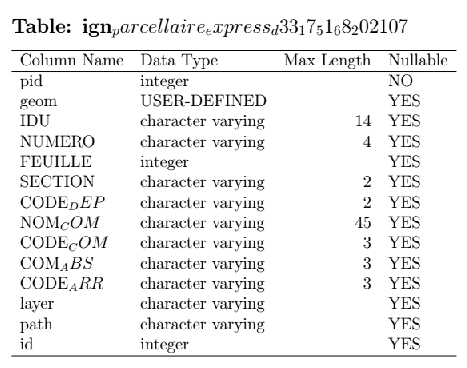

# Synthesis :
Using `psycopg2` and `Tabulate` Python packages, this script allows to create a LateX file describing each tables's columns (name, data_type, maximum character length, is it nullable).
||
|:--:| 
|*Example of metadata of a table in my local database*|
# Limitations / ~road-map :
- get comment on each columns (if they exists) 
- the LateX presentation is awful, and there's some bugs
- data type for geometry columns is considered as "user-defined", it should be handled by the script
- Ideally it could be parameterized and also accept flat files like Shapefile